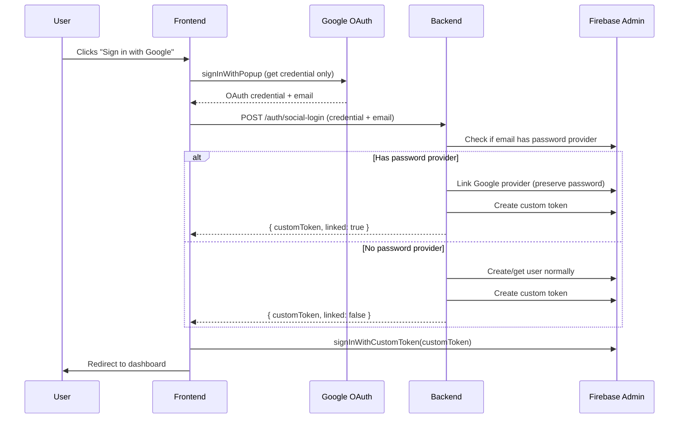

# Account Linking Without Password Confirmation

## Problem

When a user has an existing **email/password** account and signs in with **Google** using the same email, Firebase overwrites the password provider. This happens because Google is considered an authoritative identity provider for Google-hosted emails (like `@gmail.com`), so Firebase doesn't throw the `auth/account-exists-with-different-credential` error – it just overwrites.

## Solution

Implement a **backend-controlled OAuth flow** that intercepts the Google authentication and properly links the provider without overwriting the existing password provider.

### Flow Diagram



## Proposed Changes

### Backend

#### [NEW] [socialAuthService.ts](file:///projects/learning/firebase-auth/packages/server/src/services/socialAuthService.ts)

New service to handle social authentication with proper linking:
- `handleSocialAuth(providerId, accessToken, idToken)` - Main function
- Check if email exists with password provider
- If yes, link the new provider without overwriting
- Create a Firebase custom token for the user
- Return the token to frontend

---

#### [MODIFY] [auth.ts](file:///projects/learning/firebase-auth/packages/server/src/routes/auth.ts)

Add new endpoint:
- `POST /auth/social-login` - Handles social login with proper provider linking
  - Accepts: `{ accessToken, idToken?, providerId }`
  - Returns: `{ success, customToken, message, linked }`

---

### Frontend

#### [MODIFY] [api.ts](file:///projects/learning/firebase-auth/packages/client/src/lib/api.ts)

Add new function:
- `socialLogin(credential, providerId)` - Calls the new backend endpoint

---

#### [MODIFY] [page.tsx (login)](file:///projects/learning/firebase-auth/packages/client/src/app/login/page.tsx)

Modify [handleSocialLogin](file:///projects/learning/firebase-auth/packages/client/src/app/register/page.tsx#45-94):
- Import `signInWithCustomToken` from Firebase
- After getting credential from popup, call backend `socialLogin`
- Use returned `customToken` to sign in with `signInWithCustomToken`
- Show appropriate message if accounts were linked

---

#### [MODIFY] [page.tsx (register)](file:///projects/learning/firebase-auth/packages/client/src/app/register/page.tsx)

Same changes as login page to use the new backend-controlled flow.

---

## Verification Plan

### Manual Testing

1. **Test Case 1: New Google Sign-in (no existing account)**
   - Sign in with Google for an email that has no account
   - Expected: New account created, normal sign-in

2. **Test Case 2: Google Sign-in with existing password account**
   - Create account with email/password
   - Sign in with Google using the same email
   - Expected: Google linked, password preserved
   - Verify: Can still log in with email/password

3. **Test Case 3: Google Sign-in with only Google account**
   - Sign in with Google (already has Google provider only)
   - Expected: Normal sign-in, no changes

### Verification Commands

```bash
# Build and run the server
cd packages/server && npm run build && npm run dev

# Build and run the client
cd packages/client && npm run dev
```
