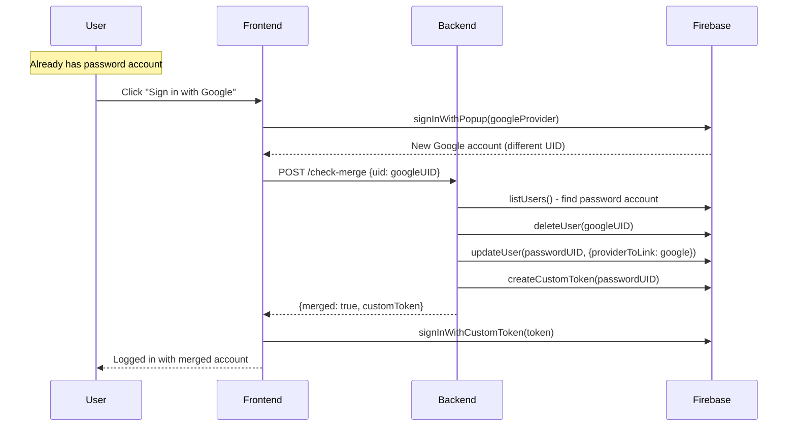
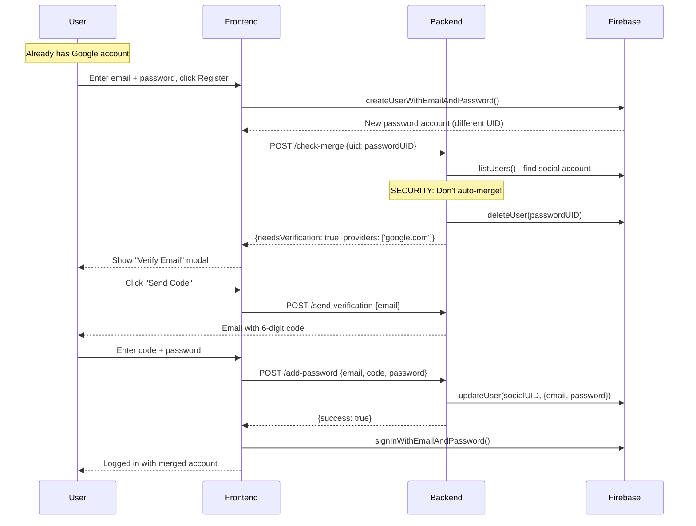
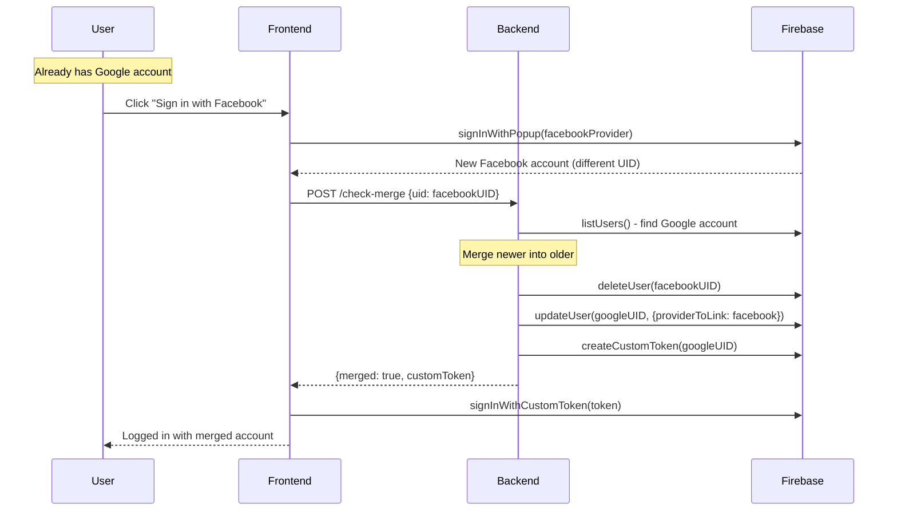

# Account Merge: "Create Multiple Accounts" Strategy

This document describes how to implement secure account linking using Firebase's **"Create multiple accounts for each identity provider"** setting.

## Firebase Configuration

In **Firebase Console** → **Authentication** → **Settings** → **User account linking**:

Select: **"Create multiple accounts for each identity provider"**

This allows the same email to have separate accounts for different providers:
- One account for email/password
- One account for Google
- One account for Facebook
- etc.

## Why This Approach?

### Problems with "Link accounts with same email" setting:

1. **Google overwrites password provider** - If user registers with email/password first, then signs in with Google, the password provider is silently removed
2. **Loss of control** - Automatic linking happens without user consent
3. **Security concerns** - OAuth providers control the linking behavior

### Benefits of "Create multiple accounts":

1. **Full control** - You decide when and how to merge
2. **Preserves all providers** - Password is never overwritten
3. **Security** - Can require verification before merging

---

## Architecture

```
┌─────────────────────────────────────────────────────────────────────┐
│                         Frontend                                     │
│  ┌──────────────────┐     ┌──────────────────┐                      │
│  │ signInWithPopup  │     │ createUserWith...│                      │
│  │ (Social Login)   │     │ (Email/Password) │                      │
│  └────────┬─────────┘     └────────┬─────────┘                      │
│           │                        │                                 │
│           └──────────┬─────────────┘                                │
│                      ▼                                               │
│              checkMerge(uid)  ──────────────────────┐               │
│                      │                               │               │
└──────────────────────┼───────────────────────────────┼───────────────┘
                       ▼                               ▼
┌─────────────────────────────────────────────────────────────────────┐
│                         Backend                                      │
│                                                                      │
│  POST /api/auth/check-merge                                          │
│           │                                                          │
│           ▼                                                          │
│  ┌─────────────────────────────────────────────────────────┐        │
│  │              checkAndMergeAccounts()                     │        │
│  │                                                          │        │
│  │  1. Get current user's email (from user or providerData)│        │
│  │  2. Search for OTHER accounts with same email           │        │
│  │  3. Determine merge case and handle appropriately       │        │
│  └─────────────────────────────────────────────────────────┘        │
└─────────────────────────────────────────────────────────────────────┘
```

---

## Merge Cases

### CASE 1: Social → Password (SAFE ✅)

User registers with email/password first, then signs in with Google.



**Result:** Google provider linked to password account. Password preserved.

---

### CASE 2: Password → Social (REQUIRES VERIFICATION ⚠️)

User has social account, tries to register with email/password.



**Why verification?** Without it, anyone who knows your email could create a password and hijack your account!

---

### CASE 3: Social → Social (SAFE ✅)

User signs in with Google, then signs in with Facebook (same email).



**Result:** Facebook linked to existing Google account.

---

## Security Summary

| Scenario | Auto-Merge? | Why? |
|----------|-------------|------|
| Social → Password | ✅ Yes | User authenticated via OAuth |
| Password → Social | ❌ Verify first | Prevents account hijacking |
| Social → Social | ✅ Yes | User authenticated via OAuth |

---

## Critical Implementation Notes

### ⚠️ 1. Email is in `providerData`, not `user.email`

With "Create multiple accounts" setting, **`user.email` is often `undefined`**. The email is only stored in `providerData`:

```typescript
// WRONG - often undefined with this setting
const email = user.email;

// CORRECT - check both locations
let email = user.email;
if (!email && user.providerData.length > 0) {
  for (const provider of user.providerData) {
    if (provider.email) {
      email = provider.email;
      break;
    }
  }
}
```

### ⚠️ 2. Search users by `providerData` email

`auth.getUserByEmail(email)` won't find users whose email is only in `providerData`. You must search all users:

```typescript
let existingUser;
try {
  existingUser = await auth.getUserByEmail(email);
} catch (e: any) {
  if (e.code === 'auth/user-not-found') {
    // Search all users by providerData email
    const listResult = await auth.listUsers(1000);
    for (const user of listResult.users) {
      if (user.email === email) {
        existingUser = user;
        break;
      }
      for (const provider of user.providerData) {
        if (provider.email === email) {
          existingUser = user;
          break;
        }
      }
      if (existingUser) break;
    }
  }
}
```

### ⚠️ 3. Don't auto-sync on auth state change

If your `AuthContext` calls `syncUser()` on `onAuthStateChanged`, it creates a race condition:

```typescript
// WRONG - creates race condition with checkMerge
onAuthStateChanged(auth, async (user) => {
  if (user) {
    await syncUser(user);  // ❌ Syncs before merge check
  }
});

// CORRECT - sync explicitly after successful login/register
onAuthStateChanged(auth, async (user) => {
  // Don't sync here - sync is handled in login/register handlers
  setUser(user);
  setLoading(false);
});
```

### ⚠️ 4. Set email when adding password

When adding password to social account, you MUST also set email at account level:

```typescript
// WRONG - login will fail because email is only in providerData
await auth.updateUser(uid, { password });

// CORRECT - set email at account level for signInWithEmailAndPassword to work
await auth.updateUser(uid, { 
  email: email,    // Required for email/password login!
  password 
});
```

### ⚠️ 5. Delete before link

You must delete the duplicate account BEFORE linking its provider to another account:

```typescript
// WRONG - causes FEDERATED_USER_ID_ALREADY_LINKED error
await auth.updateUser(targetUID, { providerToLink: { providerId, uid } });
await auth.deleteUser(sourceUID);

// CORRECT - delete first to release the provider UID
await auth.deleteUser(sourceUID);
await auth.updateUser(targetUID, { providerToLink: { providerId, uid } });
```

---

## Implementation Files

| Component | File | Purpose |
|-----------|------|---------|
| Backend merge logic | `backend/src/services/socialAuthService.ts` | `checkAndMergeAccounts()` |
| API endpoints | `backend/src/routes/auth.ts` | `/check-merge`, `/send-verification`, `/add-password` |
| Frontend API | `frontend/src/lib/api.ts` | `checkMerge()` |
| Register page | `frontend/src/app/register/page.tsx` | Handles merge responses |
| Auth context | `frontend/src/context/AuthContext.tsx` | NO auto-sync |
| Verification modal | `frontend/src/components/AddPasswordModal.tsx` | Email verification flow |

---

## Key Code: checkAndMergeAccounts()

```typescript
// CASE 1: Social → Password (SAFE)
if (!currentHasPassword && targetHasPassword) {
  // Delete social, link to password account
  await auth.deleteUser(socialUID);
  await auth.updateUser(passwordUID, { providerToLink: socialProvider });
  return { merged: true, customToken };
}

// CASE 2: Password → Social (REQUIRES VERIFICATION)
if (currentHasPassword && !targetHasPassword && targetHasSocial) {
  // Delete password account, require verification
  await auth.deleteUser(passwordUID);
  return { needsVerification: true, providers: socialProviders, email };
}

// CASE 3: Social → Social (SAFE)
if (!currentHasPassword && currentHasSocial && !targetHasPassword && targetHasSocial) {
  // Delete newer, link to older
  await auth.deleteUser(newerUID);
  await auth.updateUser(olderUID, { providerToLink: newerProvider });
  return { merged: true, customToken };
}
```
